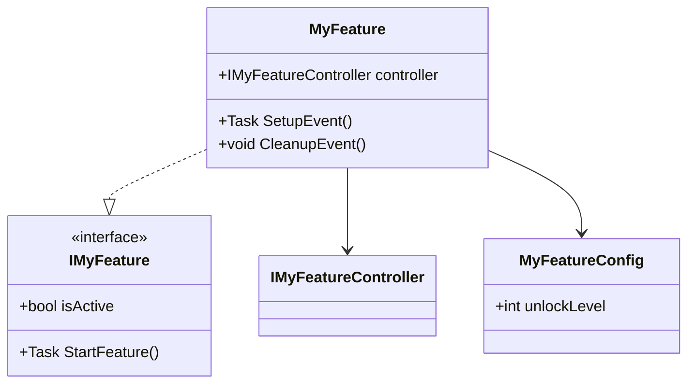
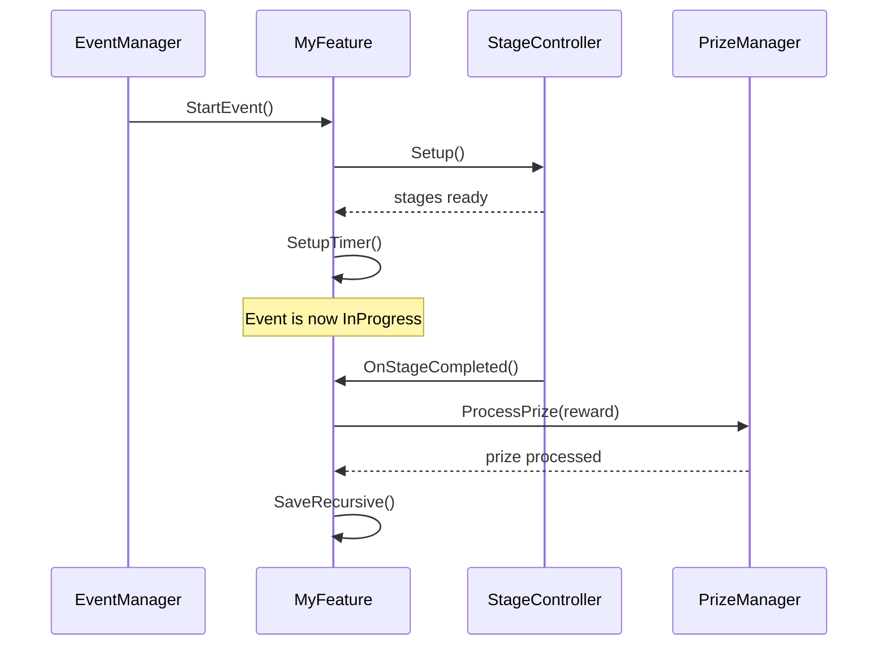

## apply: on-demand — loaded by [[CreateFeature/index]]

# Phase 3 — Design

Goal: Produce a complete architectural proposal and visualize it as a Mermaid diagram before any code is written. The engineer reviews and modifies both before Gate 3 is cleared.

---

## Step 1 — Design Proposal

Structure and contracts only. No implementation code.

```yaml
design_proposal:
  new_files:
    - path: "relative/path/FileName.cs"
      responsibility: "one-line description"
  modified_files:
    - path: "relative/path/FileName.cs"
      change: "one-line description of what changes and why"
  class_structure:
    - "ClassName : BaseClass, IInterface — one-line responsibility"
  public_contracts:
    - "IMyFeature — list methods and properties the feature exposes"
  integration_steps:
    - "Step 1: Register in X"
    - "Step 2: Run Y tool"
  open_questions:
    - "Any ambiguity requiring engineer input before diagrams are drawn"
```

Resolve all open questions with the engineer before proceeding to diagrams.

---

## Step 2 — Architecture Diagrams

Generate the following two diagrams based on the approved proposal. Present both to the engineer for review and modification before requesting gate approval.

### Diagram A — Class Structure

Shows ownership, inheritance, and interface contracts. Use `classDiagram`.

```yaml
class_diagram_rules:
  - Show every new class and interface from the proposal.
  - Show one level of existing base classes/interfaces being extended.
  - Mark composition with --> and inheritance with <|-- (standard Mermaid classDiagram notation).
  - Annotate interfaces with <<interface>>.
  - Include only public contracts on each node — no private members.
```

Example shape (fill with actual design):



### Diagram B — Key Flow

Shows the primary runtime sequence for the feature's main use case. Use `sequenceDiagram`.

```yaml
sequence_diagram_rules:
  - Cover the happy path from trigger to completion.
  - Show the key actors (systems, managers, controllers) as participants.
  - Include the most critical decision points and async awaits.
  - Keep it to the main flow — edge cases are in the use cases document, not here.
```

Example shape (fill with actual design):



---

## Step 3 — Diagram Review

Present both diagrams to the engineer. Capture all requested changes:

```yaml
diagram_review:
  class_diagram_changes:   []
  sequence_diagram_changes: []
  additional_diagrams_needed: []   # e.g. a second sequence for an edge case flow
```

Update the diagrams and re-present until the engineer is satisfied. Save the final diagrams to the feature's working folder as `[FeatureName]_Architecture.md`.

---

## Gate 3 — Design Approved

Engineer explicitly approves both the design proposal and the diagrams. Capture any final revisions.

**This is the last gate before code is written. Diagrams must be finalized and all open questions resolved before proceeding.**
